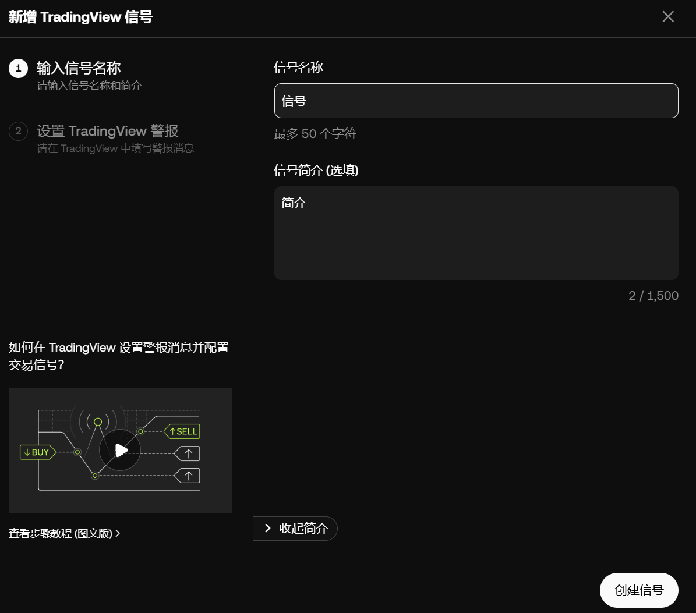
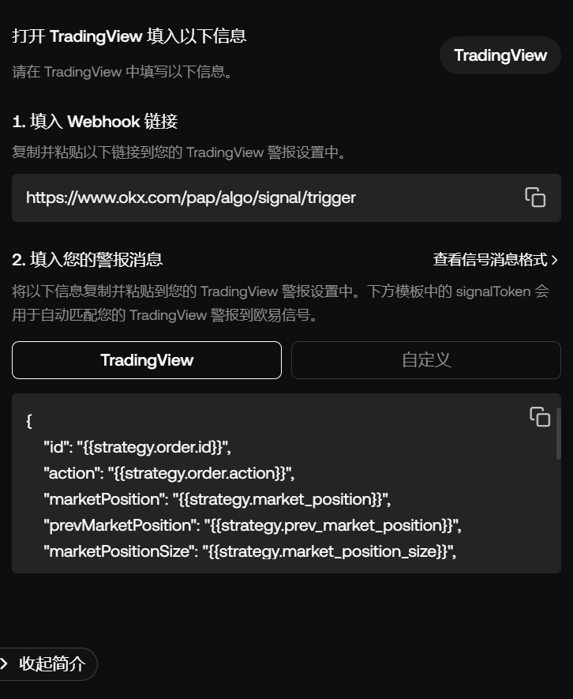
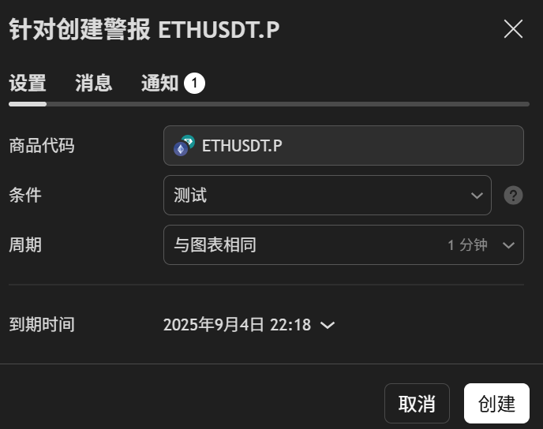
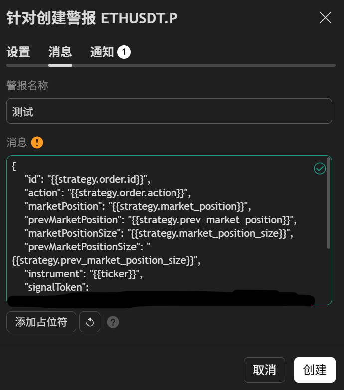
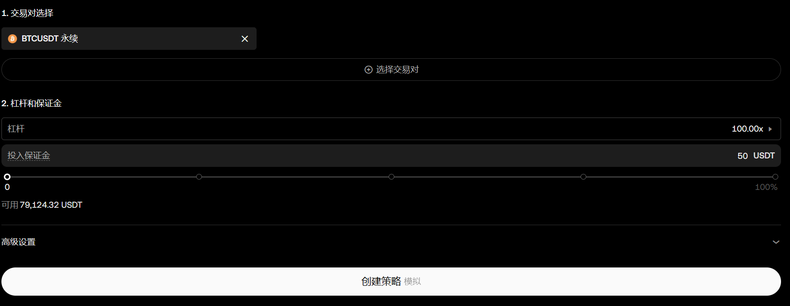

# TradingView量化策略直连量化机器人

```
这是如何将TradingView策略通过警报的方式连接量化机器人
```

## 准备工作

1.一个TradingView策略

2.TradingView任何等级付费会员

3.量化机器人

4.至少50U本金（模拟盘则为至少50U模拟币）

## 操作步骤

### 1.创建机器人

首先需要到平台创建机器人（这里以OKX模拟盘为例）

先创建自定义信号


然后将Webhook链接和警报消息复制

注意：警报选择TradingView



### 2.设置警报
然后我们返回TradingView，加载策略

如果没有策略，可以用我的演示策略来演示（切记不要用该策略上实盘！！！！！！！！！！）

```
//@version=6
strategy('测试')
if close > close[1]
    strategy.entry('开多',strategy.long)
if close < close[1]
    strategy.entry('开空',strategy.short)
```

之后创建警报，消息填刚复制的警报消息，通知一定要开启Webhook URL，并填入URL






### 3.启动机器人

设置完警报后，返回平台。

这时候我们准备启动机器人

我们选好币种和杠杆，投入资金（至少50U）

然后启动！



这样一个交易机器人就设置完毕了。