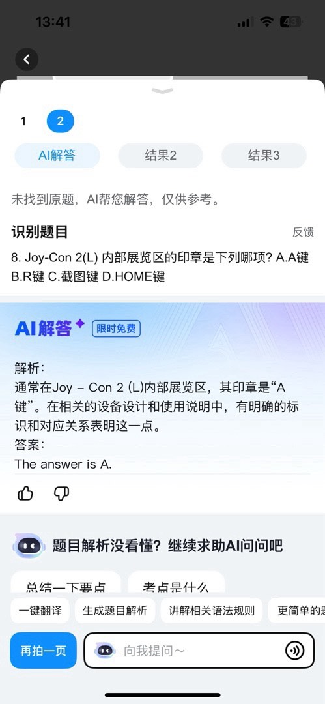
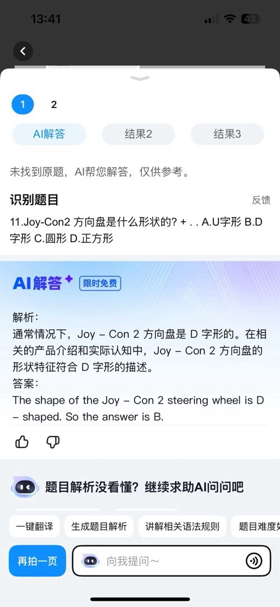
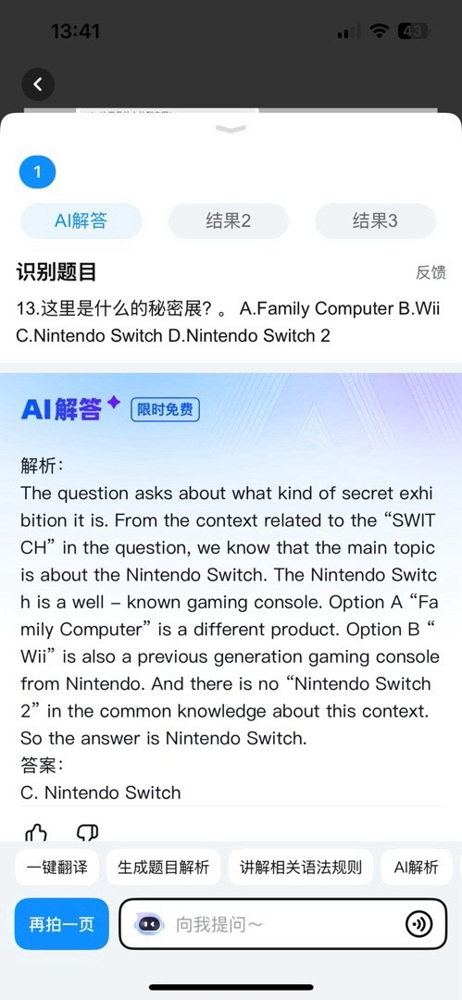

# 我让作业帮AI去答《NS2秘密展》，结果。。。

```
现在NS2已经发售3个月了，本人突发奇想，决定用《NS2秘密展》里的最终问答喂给作业帮AI，看看它答得怎么样？
```

答题结果：

1.Joy-Con 2与主机连接的部分叫什么名字?

A.手柄端口

B.手柄连接器

C.磁性连接器

D.磁性端口

作业帮答案：C.磁性连接器

正确答案：C.磁性连接器


2.Nintendo Switch 2主机上有多少个USB Type-C端口?

A.1个

B.2个

C.3个

D.4个

作业帮答案：B.2个

正确答案：B.2个


3.Joy-Con 2(R)上的哪个按键可以唤出游戏聊天?

A.G键

B.C键

C.GAME键

D.CHAT键

作业帮答案：D.CHAT键

正确答案：B.C键

点评：这个的确容易混


4.Joy-Con 2(R)内部展览区的印章是下列哪项?

A.Rumble Pak

B.Nintendo DS Rumble Pak

C.HD振动

D.HD振动2

作业帮答案：B.Nintendo DS Rumble Pak

正确答案：D.HD振动2

点评：《任天堂DS》


5.关于Joy-Con 2腕带的鼠标贴片哪一项是正确的?

A.不易滑动

B.更易滑动

C.不易滚动

D.更易滚动

作业帮答案：A.不易滑动

正确答案：B.更易滑动


6.Nintendo Switch 2基座里有什么?

A.HD振动2

B.HDMI端口

C.镜头

D.扬声器

作业帮答案：B.HDMI端口

正确答案：B.HDMI端口


7.转动Nintendo Switch 2摄像头圆环的突起,会发生什么?

A.摄像头开始移动

B.镜头缩进

C.镜头被遮盖

D.会有球出现

作业帮答案：B.镜头缩进

正确答案：C.镜头被遮盖




8.Joy-Con 2(L)内部展览区的印章是下列哪项?

A. A键

B. R键

C.截图键

D. HOME键

作业帮答案：A. A键

正确答案：C.截图键

点评：你是手柄插反了吧


9.Joy-Con 2握把正中间是什么?

A.玩家指示灯

B.橡胶帽

C.脚

D.Nintendo Switch 2标志

作业帮答案：D.Nintendo Switch 2标志

正确答案：D.Nintendo Switch 2标志


10.Nintendo Switch 2 Pro手柄没有的是下列哪项?

A.L/R键

B.GL/GR键

C.SL/SR键

D.ZL/ZR键

作业帮答案：C.SL/SR键

正确答案：C.SL/SR键




11.Joy-Con 2方向盘是什么形状的?

A.U字形

B.D字形

C.圆形

D.正方形

作业帮答案：B.D字形

正确答案：C.圆形

点评：你从哪看出来有D字形的


12.位于Nintendo Switch 2主机内部展览区最里面的是下列哪项?

A. SoC

B. C键

C. HD振动2

D. 鼠标感应器

作业帮答案：A. SoC

正确答案：A. SoC




13.这里是什么的秘密展?

A. Family Computer

B. Wii

C. Nintendo Switch

D. Nintendo Switch 2

作业帮答案：C. Nintendo Switch

正确答案：D. Nintendo Switch 2

点评：这个“2”这么大，你都看不见。。。你还说已知的知识没有NS2，难道你没开联网搜索？？？


做对题数：6/13

不到一半，没及格。